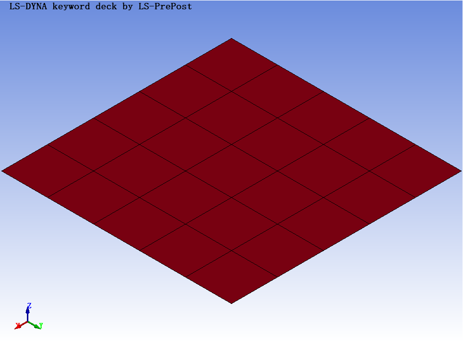

# LS-PrePost-MCP

面向自然语言的 LS-PrePost 前后处理自动化：MCP 工具、原生命令/SCL/Python 接口、结果读取与可追溯工作流。

**状态：早期开发版。目标版本为 4.8、4.10、4.13。目标覆盖常用功能，不代表当前已覆盖。**

本项目独立实现任务与执行核心，吸收公开项目、官方文档和本地案例的接口经验；可复用数据与依赖按各自许可证接入。来源、已实现能力、实机验证和待开发功能分别登记，详见 [来源与复用](docs/SOURCES.md)、[兼容性](docs/COMPATIBILITY.md)、[开发路线](docs/ROADMAP.md)。

## 已实现的第一批能力

- 标准 MCP stdio 服务及同源 CLI。
- 每任务独立目录、命令文件、输入身份、结构化结果、超时处理和日志。
- 应用内 Python 探测、模型计数、节点/部件查询、单元连通性。
- 原生壳板网格创建、保存副本、重新读取、PNG 导出。
- 原生 SCL 探测，不依赖应用内 Python。
- 节点向量和时程接口；原生 d3plot 路线仍有当前样例兼容问题，见矩阵。
- 可选 LASSO d3plot/binout 数值读取后端，明确返回 `backend=lasso`。
- 多安装版本配置和按版本调用，避免全局切换实例。
- 命令目录、官方教程验收案例、来源索引和配套 [Skill](skills/ls-prepost/SKILL.md)。



上图来自初始实机测试生成的 5×5 壳网格。未使用真实工程模型作为公开演示。

## 安装

外部 MCP 环境使用 Python 3.11+。LS-PrePost 自身的嵌入式解释器独立管理，不能把外部环境直接强塞进去。

```shell
git clone https://github.com/lwz20210407/LS-PrePost-MCP.git
cd LS-PrePost-MCP
uv sync --extra dev --extra results
```

不使用 uv 时：

```shell
python -m venv .venv
python -m pip install -e ".[dev,results]"
```

上述 pip 命令应在已激活的 `.venv` 中执行，或使用该环境的 Python 绝对路径。

## 本机配置

设置以下环境变量。示例路径需替换为自己的安装和任务目录：

```powershell
$env:LSPP_EXECUTABLE = 'C:\path\to\lsprepost.exe'
$env:LSPP_WORKSPACE = 'C:\path\to\lspp-jobs'
$env:LSPP_ALLOWED_ROOTS = 'C:\path\to\models;C:\path\to\results'
$env:LSPP_TIMEOUT = '120'
```

`LSPP_WORKSPACE` 是唯一产物入口；已有输入文件不会被覆盖。输入可以位于该目录或允许的根目录。Linux 的根目录列表使用 `:` 分隔。

可选多版本配置：

```powershell
$env:LSPP_EXECUTABLES = '{"4.8":"C:/path/4.8/lsprepost.exe","4.10":"C:/path/4.10/lsprepost.exe","4.13":"C:/path/4.13/lsprepost.exe"}'
```

MCP 客户端使用本项目虚拟环境里的 `ls-prepost-mcp` 可执行入口，或以该环境的 Python 启动 `-m ls_prepost_mcp.server`，并传入上述环境变量。服务使用 stdio；不要将调试打印写到协议 stdout。

## CLI 与自然语言示例

```shell
uv run lspp capabilities
uv run lspp probe_environment
uv run lspp create_shell_plate --json '{"nx":5,"ny":5,"size":[10,10],"units":"mm-ms-g"}'
```

JSON 的引号规则随 shell 而异；也可以通过 MCP 直接传结构化参数。

可让代理执行：

- “用指定版本建立 10×10 的板，划分成 5×5 壳单元，保存后重开检查，再导出等轴测图。”
- “列出这个模型前一百个节点，保留真实节点ID和原始坐标。”
- “用 LASSO 提取指定节点在第1、2状态的位移向量，单位保持模型原单位。”
- “检索 Shell Drag 的官方步骤和验收条件，区分文档支持与已自动化功能。”

每次原生调用返回 job ID、状态、日志和产物；`failed` 不应被代理总结为成功。CLI 在任务失败时返回非零退出码。`search_commands` 的命中只代表参考资料，不能直接当成已验证可执行命令。

## 测试

```shell
uv run pytest
```

CI 测试不启动商业软件。实机冒烟需要合法安装，并在用户指定目录内运行生成案例或授权样例。结果见 [兼容性记录](docs/COMPATIBILITY.md)。

## 已知边界

- 目前没有任意 Python/shell 执行工具，也没有接管既有 GUI 会话。
- 文件范围检查属于应用层边界，不是操作系统沙箱。
- 暂仅支持普通 `*INCLUDE`；复杂 include path/参数变换规则会明确拒绝。
- 原生渲染依赖图形环境，`-nographics` 不等于真正无图形；未把 `runc=` 推广到旧版本。
- 输入单位由调用者声明，不进行隐式推断或材料参数补全。
- 当前没有求解器启动工具。复杂网格、材料/边界/接触、碎片等能力按路线逐步建设。

本项目代码使用 MIT。命令目录来自 Apache-2.0 项目，独立条款见 [NOTICE](NOTICE.md)。LS-PrePost/LS-DYNA、官方手册及其他第三方组件保留各自权利；本仓库不分发厂商软件、手册全文或私有模型。

